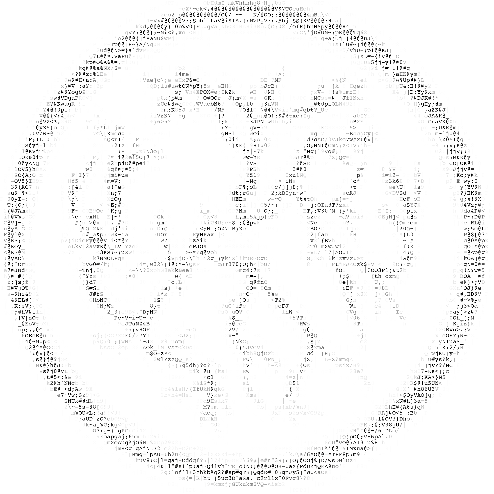

<!-- Template from: https://github.com/othneildrew/Best-README-Template -->
<!--/Users/jorgemuyo/Library/Application Support/McNeel/Rhinoceros/8.0/Plug-ins/Grasshopper (b45a29b1-4343-4035-989e-044e8580d9cf)/Libraries-->
<a name="readme-top"></a>

[![Contributors][contributors-shield]][contributors-url]
[![Forks][forks-shield]][forks-url]
[![Stargazers][stars-shield]][stars-url]
[![Issues][issues-shield]][issues-url]
[![MIT License][license-shield]][license-url]
[![LinkedIn][linkedin-shield]][linkedin-url]

<!-- HEADER -->
<br />
<div align="center">
  <a href="https://github.com/jmuozan/ArsPostFaber">
    
  </a>

<h3 align="center">ArsPostFaber</h3>

  <p align="center">
    Art Post Artisan
    <br />
    <a href="https://jmuozan.github.io/ArsPostFaber-docs/"><strong>Explore the docs »</strong></a>
    <br />
    <br />
    <a href="https://github.com/github_username/ArsPostFaber">View Demo</a>
    ·
    <a href="https://github.com/github_username/ArsPostFaber/issues">Report Bug</a>
    ·
    <a href="https://github.com/github_username/ArsPostFaber/issues">Request Feature</a>
  </p>
</div>


<!-- TABLE OF CONTENTS -->
<details>
  <summary>Table of Contents</summary>
  <ol>
    <li>
      <a href="#about-the-project">About The Project</a>
      <ul>
        <li><a href="#built-with">Built With</a></li>
      </ul>
    </li>
    <li>
      <a href="#getting-started">Getting Started</a>
      <ul>
        <li><a href="#prerequisites">Prerequisites</a></li>
        <li><a href="#installation">Installation</a></li>
      </ul>
    </li>
    <li><a href="#components-overview">Components Overview</a></li>
    <li><a href="#roadmap">Roadmap</a></li>
    <li><a href="#contributing">Contributing</a></li>
    <li><a href="#license">License</a></li>
    <li><a href="#contact">Contact</a></li>
    <li><a href="#acknowledgments">Acknowledgments</a></li>
  </ol>
</details>


<!-- ABOUT THE PROJECT -->
## About The Project

ArsPostFaber is a digital fabrication toolkit for Grasshopper that attempts to bridge the gap between parametric design and physical production. This plugin provides five categories of tools to implement in digital fabrication workflows:

- 🤖 **AI-Powered Component Generation** - Create custom Grasshopper components using natural language descriptions
- 🏭 **Advanced 3D Printing Pipeline** - Complete toolchain from geometry to G-code 
- 📡 **Professional Serial Communication** - 3D printer live control and monitoring
- 🔧 **Interactive Mesh Processing** - Realtime mesh editing 
- 📱 **Mobile Photogrammetry** - 3D reconstruction from smartphone capture connection

<p align="right">(<a href="#readme-top">back to top</a>)</p>

### Built With

* [![C#][CSharp-shield]][CSharp-url]
* [![.NET][DotNet-shield]][DotNet-url]
* [![Grasshopper][GH-shield]][GH-url]
* [![Rhino][Rhino-shield]][Rhino-url]

<p align="right">(<a href="#readme-top">back to top</a>)</p>

## Getting Started

For documentation, tutorials, and examples, visit the documentation website: **📚 [Ars Post Faber docs](https://jmuozan.github.io/ArsPostFaber-docs/)**

### Prerequisites

Before installing ArsPostFaber, ensure you have:

* **Rhino 3D 8.0+** - The plugin is built for Rhino 8
* **Grasshopper** - Included with Rhino installation
* **.NET 7.0 Runtime** - Required for the plugin components (in case you want to keep developimng)
* **For AI Components**: OpenAI API keys or Ollama installation for local models
* **For Photogrammetry**: macOS device with RealityKit support (photogrammetry component will only work on macOS)

### Installation

1. Download the latest release from the food4rhino page (currently not uploaded, you can download the .gha in this repo)
2. Copy the `.gha` file to your Grasshopper Libraries folder:
   ```
   Windows: %APPDATA%\Grasshopper\Libraries\
   macOS: ~/Library/Application Support/McNeel/Rhinoceros/8.0/Plug-ins/Grasshopper/Libraries/
   ```
3. Restart Rhino and Grasshopper
4. Components will appear in the "crft" tab

### Quick Start Simplified Use

1. **AI Component Generation**: Add a "Component that Makes" component, enter your description, and watch as custom components are generated
2. **3D Printing**: Use the slicer pipeline components to convert geometry to G-code
3. **Serial Control**: Connect to your 3D printer and stream G-code with real-time monitoring
4. **Photogrammetry**: Generate QR codes to capture with mobile devices and reconstruct 3D models

<p align="right">(<a href="#readme-top">back to top</a>)</p>

## Components Overview

### 🤖 AI-Powered Component Generation

#### Component that Makes (API)
Generate custom Grasshopper components using OpenAI's GPT models. Simply describe what you want in natural language and get a fully compiled component.
- **Inputs**: Description, API key, model selection, component name
- **Outputs**: Generated code, compiled component, status messages
- **Technical Implementation**: 
  - Microsoft.CodeAnalysis.CSharp (Roslyn compiler) for real-time compilation
  - Implements "agent" mode with recursive error correction using compilation diagnostics
  - Supports PDF context integration using iText7 for enhanced code generation
  - Cross-platform assembly loading and component instantiation

```csharp
// Example of the compilation process
var compilation = CSharpCompilation.Create(assemblyName)
    .WithOptions(new CSharpCompilationOptions(OutputKind.DynamicallyLinkedLibrary))
    .AddReferences(MetadataReference.CreateFromFile(typeof(GH_Component).Assembly.Location))
    .AddSyntaxTrees(CSharpSyntaxTree.ParseText(generatedCode));
```

#### Component that Makes (Local)  
Same functionality as the API version but uses local Ollama local models for offline operation.
- **Inputs**: Description, local model selection, generation parameters
- **Outputs**: Generated code, compiled component, status messages
- **Technical Implementation**:
  - Communicates with local Ollama API via HTTP client
  - Implements infinite retry loop with compilation feedback
  - Context loading from local PDF files in plugin directory
  - Advanced prompt engineering with error-specific correction strategies

### 🏭 3D Printing Pipeline

#### Slicer Settings
Configure all parameters for the 3D printing pipeline including layer height, speeds, and printer dimensions.
- **Technical Implementation**: Creates a comprehensive settings object passed through the entire slicing pipeline

#### Slice Geometry
Convert 3D Brep geometry into horizontal layer curves ready for processing.
- **Technical Implementation**: 
  - Uses Rhino's `Intersect.Intersection.BrepPlane()` for precise horizontal slicing
  - Automatically centers geometry on print bed based on bounding box calculations
  - Outputs structured data tree with curves organized by layer index

```csharp
// Core slicing operation
var intersectionCurves = Intersect.Intersection.BrepPlane(brep, slicePlane, tolerance);
if (intersectionCurves != null && intersectionCurves.Length > 0)
{
    layerCurves.AddRange(intersectionCurves.Select(crv => crv.DuplicateCurve()));
}
```

#### Shell Geometry  
Generate perimeter shells and identify inner regions for infill from sliced curves.
- **Technical Implementation**:
  - Implements curve offsetting using `Curve.Offset()` with precise distance control
  - Handles complex multi-contour scenarios and nested geometries
  - Calculates innermost regions using Boolean operations for infill boundaries

#### Infill Geometry
Create infill toolpaths within shell regions using configurable patterns and spacing.
- **Technical Implementation**:
  - Generates linear infill patterns using geometric line-region intersections
  - Supports configurable infill angles and densities
  - Uses `Curve.CreateBooleanIntersection()` for precise boundary clipping

#### G-Code Generator
Convert processed curves into production-ready G-code with advanced motion planning and arc interpolation.
- **Technical Implementation**:
  - **Advanced Arc Detection**: Analyzes curve segments for arc fitting using radius tolerance
  - **Motion Planning**: Implements velocity profiling and acceleration limits
  - **Path Optimization**: Curve simplification and redundant point removal
  - **Cross-platform Coordinates**: Handles different printer coordinate systems and transformations

```csharp
// Arc detection and G-code generation
if (IsArcSegment(segment, out Circle arc, arcTolerance))
{
    Vector3d centerOffset = arc.Center - currentPosition;
    gcode.Add($"G{(isClockwise ? "02" : "03")} X{endPoint.X:F3} Y{endPoint.Y:F3} " +
              $"I{centerOffset.X:F3} J{centerOffset.Y:F3} F{feedRate}");
}
```

### 📡 Serial Communication

#### Serial Control
Professional-grade serial communication component for streaming G-code to 3D printers with real-time control and monitoring.
- **Features**: Play/pause controls, toolpath visualization, cross-platform compatibility
- **Inputs**: Port settings, G-code commands, printer configuration
- **Outputs**: Status updates, response messages, modified toolpaths
- **Technical Implementation**:
  - **Cross-platform Serial**: Uses both `System.IO.Ports` and `RJCP.IO.Ports` for maximum compatibility
  - **Buffer Management**: Implements intelligent command queuing with flow control
  - **Real-time Visualization**: Custom toolbar integration with play/pause controls
  - **Path Rendering**: Interactive toolpath display with executed vs. pending path visualization

```csharp
// Cross-platform serial port handling
private void InitializeSerialPort(string portName, int baudRate)
{
    if (RuntimeInformation.IsOSPlatform(OSPlatform.Windows))
        _serialPort = new System.IO.Ports.SerialPort(portName, baudRate);
    else
        _serialStream = new SerialPortStream(portName, baudRate);
}
```

### 🔧 Mesh Processing

#### Mesh Edit
Interactive mesh editing with vertex selection and real-time modification capabilities.

#### Mesh Crop  
Crop meshes to specified bounding boxes with scaling and offset controls.

### 📱 Photogrammetry

#### Photogrammetry
Complete photogrammetry pipeline using mobile device capture and RealityKit reconstruction.
- **Features**: Built-in web server, QR code connection, automatic processing
- **Inputs**: Quality settings, processing parameters
- **Outputs**: Server URL, reconstructed 3D mesh
- **Technical Implementation**:
  - **HTTP Server**: Built-in web server using `HttpListener` for mobile device communication
  - **Video Processing**: FFmpeg integration for automatic frame extraction from uploaded videos
  - **3D Reconstruction**: Interfaces with HelloPhotogrammetry (RealityKit) for high-quality mesh generation
  - **Cross-platform Networking**: Automatic IP detection and QR code generation for easy mobile connection

```csharp
// HTTP server for mobile device communication
var listener = new HttpListener();
listener.Prefixes.Add($"http://{GetLocalIPAddress()}:8080/");
listener.Start();

// QR Code generation for easy mobile access
var qrGenerator = new QRCodeGenerator();
var qrCodeData = qrGenerator.CreateQrCode(serverUrl, QRCodeGenerator.ECCLevel.Q);
var qrCode = new QRCode(qrCodeData);
```

<p align="right">(<a href="#readme-top">back to top</a>)</p>


<!-- CONTRIBUTING -->
## Contributing

Contributions are what make the open source community such an amazing place to learn, inspire, and create. Any contributions you make are **greatly appreciated**.

If you have a suggestion that would make this better, please fork the repo and create a pull request. You can also simply open an issue with the tag "enhancement".
Don't forget to give the project a star! Thanks again!

1. Fork the Project
2. Create your Feature Branch (`git checkout -b feature/AmazingFeature`)
3. Commit your Changes (`git commit -m 'Add some AmazingFeature'`)
4. Push to the Branch (`git push origin feature/AmazingFeature`)
5. Open a Pull Request

<p align="right">(<a href="#readme-top">back to top</a>)</p>


<!-- LICENSE -->
## License

Distributed under the MIT License. See `LICENSE` for more information.

<p align="right">(<a href="#readme-top">back to top</a>)</p>


<!-- CONTACT -->
## Contact

jmuozan - [@jorgemunyozz](https://twitter.com/jorgemunyozz) - jmuozan@gmail.com

Project Link: [here](https://jmuozan.github.io/ArsPostFaber-docs/)

<p align="right">(<a href="#readme-top">back to top</a>)</p>


<!-- ACKNOWLEDGMENTS -->
## Acknowledgments

Amazing projects that have inspired and helped the developement of this project

* [t43 slicer](https://github.com/LingDong-/t43?tab=readme-ov-file)
* [Robots](https://github.com/visose/Robots)
* [Vespidae](https://github.com/frikkfossdal/Vespidae)
* [Python gh Template](https://github.com/JonasFeron/PythonNETGrasshopperTemplate)
* [Advanced Developement in grasshopper](https://www.youtube.com/watch?v=Em_teGSpP9w&list=PLx3k0RGeXZ_yZgg-f2k7fO3WxBQ0zLCeU)
* [Rhino developer macos gide](https://developer.rhino3d.com/guides/rhinocommon/your-first-plugin-mac/)
* [Advenced 3D Printing in grasshopper](https://www.amazon.com/Advanced-3D-Printing-Grasshopper%C2%AE-Clay/dp/B086Y7CLLC)
* [Open3D](https://www.open3d.org/html/introduction.html)
* [Mediapipe](https://chuoling.github.io/mediapipe/solutions/holistic.html)
* [Brain plugin grasshopper](https://github.com/ParametricCamp/brain-plugin-grasshopper)


<p align="right">(<a href="#readme-top">back to top</a>)</p>


<!-- MARKDOWN LINKS & IMAGES -->
<!-- https://www.markdownguide.org/basic-syntax/#reference-style-links -->
[contributors-shield]: https://img.shields.io/github/contributors/jmuozan/ArsPostFaber.svg?style=for-the-badge
[contributors-url]: https://github.com/jmuozan/ArsPostFaber/graphs/contributors
[forks-shield]: https://img.shields.io/github/forks/jmuozan/ArsPostFaber.svg?style=for-the-badge
[forks-url]: https://github.com/jmuozan/ArsPostFaber/network/members
[stars-shield]: https://img.shields.io/github/stars/jmuozan/ArsPostFaber.svg?style=for-the-badge
[stars-url]: https://github.com/jmuozan/ArsPostFaber/stargazers
[issues-shield]: https://img.shields.io/github/issues/jmuozan/ArsPostFaber.svg?style=for-the-badge
[issues-url]: https://github.com/jmuozan/ArsPostFaber/issues
[license-shield]: https://img.shields.io/github/license/jmuozan/ArsPostFaber.svg?style=for-the-badge
[license-url]: https://github.com/jmuozan/ArsPostFaber/blob/master/LICENSE
[linkedin-shield]: https://img.shields.io/badge/-LinkedIn-black.svg?style=for-the-badge&logo=linkedin&colorB=555
[linkedin-url]: https://www.linkedin.com/in/jorgemunozzanon/
[product-screenshot]: images/screenshot.png
[CSharp-shield]: https://img.shields.io/badge/C%23-239120?style=for-the-badge&logo=c-sharp&logoColor=white
[CSharp-url]: https://docs.microsoft.com/en-us/dotnet/csharp/
[DotNet-shield]: https://img.shields.io/badge/.NET-5C2D91?style=for-the-badge&logo=.net&logoColor=white
[DotNet-url]: https://dotnet.microsoft.com/
[GH-shield]: https://img.shields.io/badge/Grasshopper-8BC34A?style=for-the-badge&logo=grasshopper&logoColor=white
[GH-url]: https://www.grasshopper3d.com/
[Rhino-shield]: https://img.shields.io/badge/Rhino3D-FF6B6B?style=for-the-badge&logo=rhinoceros&logoColor=white  
[Rhino-url]: https://www.rhino3d.com/


## Repository Structure

```
ArsPostFaber/
├── src/                              # Source code directory
│   ├── LLM/                          # AI-powered component generation
│   │   ├── GenerativeComps/          # Core AI components (renamed from OllamaComps)
│   │   │   ├── ComponentThatMakesLocal.cs    # Local Ollama-powered generation
│   │   │   ├── ComponentThatMakesAPI.cs      # OpenAI API-powered generation
│   │   │   ├── OllamaModelParam.cs           # Ollama model dropdown parameter
│   │   │   ├── OpenAIModelParam.cs           # OpenAI model dropdown parameter
│   │   │   ├── PdfContextManager.cs          # PDF context loading utility
│   │   │   └── PdfContextExtractor.cs        # PDF text extraction utility
│   │   └── Templates/                # Base templates and utilities
│   │       └── GH_Component_HTTPAsync.cs     # Async HTTP component base class
│   ├── Slicer/                       # 3D printing slicer components
│   │   ├── SlicerSettings.cs         # Configuration data structure
│   │   ├── SlicerSettingsComponent.cs # Settings configuration component
│   │   ├── SliceGeometryComponent.cs  # Geometry to layer slicing
│   │   ├── ShellGeometryComponent.cs  # Perimeter shell generation
│   │   ├── InfillGeometryComponent.cs # Infill pattern generation
│   │   └── GCodeGeneratorComponent.cs # G-code output generation
│   ├── Serial/                       # Serial communication for 3D printers
│   │   ├── serialcontrolComponent.cs  # Main serial control component
│   │   ├── SerialPortWrapper.cs      # Cross-platform serial abstraction
│   │   ├── SerialControlUI.cs        # Custom toolbar and UI controls
│   │   ├── PortParam.cs             # Serial port dropdown parameter
│   │   ├── PreviewEtoForm.cs        # Preview window for toolpaths
│   │   └── TestPrinterConnection.cs  # Connection diagnostic utility
│   ├── Mesh/                         # Mesh processing and editing
│   │   ├── MeshEditComponent.cs      # Interactive mesh editing component
│   │   ├── MeshCropComponent.cs      # Bounding box mesh cropping
│   │   ├── MeshEditForm.cs           # Mesh editing UI form
│   │   └── MeshPreviewForm.cs        # Mesh preview and visualization
│   ├── Photogrammetry/               # 3D reconstruction from photos
│   │   └── PhotogrammetryComponent.cs # Complete photogrammetry pipeline
│   └── ArsPostFaberInfo.cs          # Plugin assembly information
├── scripts/                          # External utilities and scripts
│   └── photogrammetry/              # Photogrammetry processing scripts
│       └── HelloPhotogrammetry       # RealityKit reconstruction binary
├── docs/                            # Documentation and assets
│   ├── images/                      # Documentation images
│   └── 3D_Files/                    # Example 3D models and test files
├── Icons/                           # Plugin icons and UI assets
├── ArsPostFaber.csproj              # Project file with dependencies
├── ArsPostFaber.sln                 # Visual Studio solution file
└── README.md                        # This documentation file
```

### Key Architecture Patterns

- **Component Inheritance**: All Grasshopper components inherit from `GH_Component` or custom base classes like `GH_Component_HTTPAsync`
- **Cross-platform Support**: Components use conditional compilation and runtime detection for Windows/macOS compatibility
- **Async Operations**: HTTP-based components use async/await patterns with proper cancellation support
- **Resource Management**: External processes and network connections are properly disposed and managed
- **Error Handling**: Comprehensive error handling with user-friendly messages and diagnostic information


## Build Instructions

### Prerequisites for Building

- **Visual Studio 2022** or **Visual Studio Code** with C# extension
- **.NET 7.0 SDK** - Download from [Microsoft .NET](https://dotnet.microsoft.com/download)
- **Rhino 3D 7.0+** - Required for Grasshopper and RhinoCommon references
- **Git** - For cloning the repository

### Building from Source

1. **Clone the Repository**
   ```bash
   git clone https://github.com/jmuozan/ArsPostFaber.git
   cd ArsPostFaber
   ```

2. **Restore NuGet Packages**
   ```bash
   dotnet restore ArsPostFaber.csproj
   ```

3. **Build the Project**
   ```bash
   # Debug build
   dotnet build ArsPostFaber.csproj
   
   # Release build
   dotnet build ArsPostFaber.csproj -c Release
   ```

4. **Output Location**
   The compiled `.gha` file will be located at:
   ```
   bin/Debug/net7.0/osx-arm64/ArsPostFaber.gha    # Debug (macOS ARM)
   bin/Release/net7.0/ArsPostFaber.gha            # Release (All platforms)
   ```

### Platform-Specific Notes

#### macOS
- Ensure Xcode command line tools are installed: `xcode-select --install`
- The project targets `osx-arm64` for Apple Silicon and `osx-x64` for Intel Macs
- For photogrammetry features, macOS 12.0+ is required for RealityKit support

#### Windows
- Visual Studio 2022 with ".NET desktop development" workload
- Windows 10 1903+ recommended for best serial communication compatibility

### Dependencies and Packages

The project uses several key NuGet packages:

```xml
<!-- Core Grasshopper Framework -->
<PackageReference Include="Grasshopper" Version="8.0.23304.9001" />

<!-- AI and Code Generation -->
<PackageReference Include="Microsoft.CodeAnalysis.CSharp" Version="4.5.0" />
<PackageReference Include="Newtonsoft.Json" Version="13.0.3" />

<!-- PDF Processing -->
<PackageReference Include="itext7" Version="7.2.5" />
<PackageReference Include="PdfSharp" Version="6.1.1" />

<!-- Serial Communication -->
<PackageReference Include="System.IO.Ports" Version="7.0.0" />
<PackageReference Include="SerialPortStream" Version="2.4.2" />

<!-- Cross-platform UI -->
<PackageReference Include="Eto.Forms" Version="2.5.1" />
<PackageReference Include="Eto.Platform.Mac64" Version="2.5.1" />

<!-- QR Code Generation -->
<PackageReference Include="QRCoder" Version="1.4.3" />
```

### Development Workflow

1. **Install Plugin for Testing**
   ```bash
   # Copy to Grasshopper Libraries folder
   cp bin/Debug/net7.0/ArsPostFaber.gha ~/Library/Application\ Support/McNeel/Rhinoceros/8.0/Plug-ins/Grasshopper/Libraries/
   ```

2. **Debugging**
   - Attach Visual Studio debugger to `Rhino.exe` process
   - Use `System.Diagnostics.Debugger.Launch()` in code for breakpoints
   - Check Grasshopper's "Developer" menu for component errors

3. **Testing Components**
   - Use Grasshopper's "Create User Object" to save component configurations
   - Test cross-platform compatibility using virtual machines or multiple devices
   - Verify serial communication with actual 3D printer hardware

### Building Documentation

The documentation website is built using GitHub Pages. To build locally:

```bash
# Install dependencies (if using Jekyll)
gem install jekyll bundler
bundle install

# Serve locally
bundle exec jekyll serve

# View at http://localhost:4000
```
